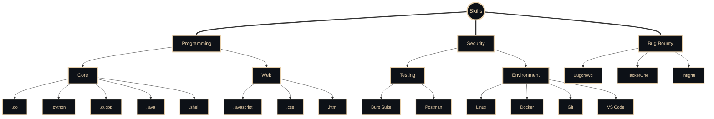

<!-- Banner Image (if you have a custom banner, ensure it matches the new color scheme) -->
<!--  -->

<p align="right">

</p>


<div style="border: 2px solid #E7CFAA; border-radius: 10px; padding: 20px; margin-bottom: 20px;">

<!-- Name Banner -->
<p align="center">
  <a href="https://github.com/1hehaq">
    
  </a>
</p>

<!-- Follow Buttons -->
<p align="center">
  <a href="https://komarev.com/ghpvc/?username=1hehaq&color=E7CFAA"></a>
  <a href="https://github.com/1hehaq"></a>
  <a href="https://twitter.com/1hehaq"></a>
</p>

</div>

<div style="border: 2px solid #E7CFAA; border-radius: 10px; padding: 20px; margin-bottom: 20px;">

<!-- Who Am I -->
<h2 align="center">
  
</h2>


<!-- Typing SVG -->
<p align="center">
  <a href="https://github.com/1hehaq"></a>
</p>

  

```python
#!/usr/bin/python
# -*- coding: utf-8 -*-


class SecurityResearcher:

    def __init__(self):
        self.name = "Haq"
        self.role = "Security Researcher, Web Developer"
        self.language_spoken = ["en_US"]
        self.portfolio = "https://1hehaq-portfolio.pages.dev"

    def say_hi(self):
        print("Thanks for stopping by!")
        print(f"Check out my portfolio at: {self.portfolio}")


me = SecurityResearcher()
me.say_hi()
```

<br>
<br>

<!-- Quote -->
<div align="right">
  <a href="https://x.com/1hehaq"></a>
  <a href="https://github.com/1hehaq"></a>
</div>

</div>

<br>
<br>
<br>
<br>


  <!-- Knowledge & Skills -->
<p align="left" style="display: flex; align-items: center;">
  <a href="https://x.com/1hehaq"></a>
  
</p>


<br>

<!-- Skills -->

<!--
<div style="display: flex; flex-wrap: wrap; justify-content: center; gap: 10px;">
  <p align="left">
      
      
      
      
      
      
      
      
      
  </p>
</div>

<br>

<div style="display: flex; flex-wrap: wrap; justify-content: center; gap: 10px;">
  <p align="left">
      
      
      
      
      
      
  </p>
</div>


<br>

<div style="display: flex; flex-wrap: wrap; justify-content: center; gap: 10px;">
  <p align="left">
    
    
    
  </p>
</div>

-->



<br>
<br>
<br>
<br>


<!-- Projects -->
<div align="right" style="border: 2px solid #E7CFAA; border-radius: 10px; padding: 20px; margin-bottom: 20px;">

  <p align="right" style="display: flex; align-items: center;">
    <a href="https://x.com/1hehaq"></a>
    
  </p>


<p align="right">
<a href="https://github.com/1hehaq/oty.git"></a>
<a href="https://tryhaqme.github.io/ReadTheSource.git"></a>
<a href="https://github.com/coffinxp/lostools.git"></a>
<a href="https://reconhawk.pages.dev"></a>
<a href="https://github.com/1hehaq/greb.git"></a>
<a href="https://github.com/1hehaq/shef.git"></a>
<!-- <a href="https://github.com/1hehaq/3PleB.git"></a> -->
<a href="https://github.com/1hehaq/alltool.git"></a>
<a href="https://github.com/1hehaq/xopy.git"></a>
<!-- <a href="https://1hehaq.github.io/portfolio"></a> -->
<!-- <a href="https://github.com/1hehaq/cantc.git"></a> -->
<!-- <a href="https://github.com/1hehaq/haq.git"></a> -->
<!-- <a href="https://gutz.pages.dev"></a> -->
<a href="https://1hehaq.github.io/website"></a>
</p>

</div>


<br>
<br>
<br>


<div style="border: 2px solid #E7CFAA; border-radius: 10px; padding: 20px; margin-bottom: 20px;">

<!-- GitHub Status -->

<div style="border: 2px solid #E7CFAA; border-radius: 10px; padding: 20px; margin-bottom: 20px;">

<h2 align="center">
  
</h2>


<div align="center" style="display: flex; flex-direction: column; justify-content: center; align-items: center; background-color: #0D1117; padding: 20px; border-radius: 10px; box-shadow: 0 4px 6px rgba(0, 0, 0, 0.1);">
  <div style="display: flex; justify-content: center; align-items: center; margin-bottom: 20px;">
    
    
  </div>
  
  
</div>

</div>


<div style="border: 2px solid #E7CFAA; border-radius: 10px; padding: 20px; margin-bottom: 20px;">

<!-- Blog Posts -->
<!-- BLOG-POST-LIST:START -->

<!-- BLOG-POST-LIST:END -->

</div>

<!-- Current Focus
<h2 align="center">
  
</h2> -->

<br>
<br>
<br>

<div style="border: 2px solid #E7CFAA; border-radius: 10px; padding: 20px; margin-bottom: 20px;">

<!-- Connect Section -->
<h2 align="center">
  
</h2>

<p align="center">
  <a href="https://x.com/1hehaq"></a>
  <a href="https://www.instagram.com/1hehaq" target="_blank"></a>
  <a href="https://www.linkedin.com/in/1hehaq"></a>
  <a href="https://t.me/th3haq"></a>
</p>

<br>
<br>

<!-- Footer -->
<p align="center">
  
</p>


